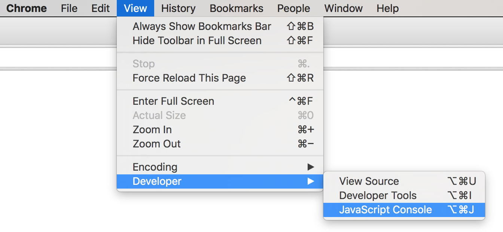

# Module 17: JavaScript
**JavaScript**  is a popular, high-level, general-purpose programming language primarily used for implementing interactive web applications and other information systems. JavaScript shares many structural (and even some syntactical) similarities with Python; the places where it differ often draws from other major major languages like Java and C (and thus are good styles to be familiar with). Overall, this makes JavaScript a useful second language to learn: programs will utilize similar structures, but demonstrate how code syntax can be abstracted in more general programming practices.

This module introduces the basic syntax of the JavaScript language, including variables, control structures, and functions. **Note** that this introduction assumes familiarity with Python, and introduces concepts in contrast to that languages. For more general purpose introductions, see the below resources.

<!-- START doctoc generated TOC please keep comment here to allow auto update -->
<!-- DON'T EDIT THIS SECTION, INSTEAD RE-RUN doctoc TO UPDATE -->
**Contents**

- [Resources](#resources)

<!-- END doctoc generated TOC please keep comment here to allow auto update -->

## Resources
As the language used for web programming, JavaScript may have more freely available online learning resources than any other language! Some of my favorites include:

- [A Re-Introduction to JavaScript](https://developer.mozilla.org/en-US/docs/Web/JavaScript/A_re-introduction_to_JavaScript) a focused tutorial on the primariy language features
- [You Don't Know JS](https://github.com/getify/You-Dont-Know-JS) a free textbook covering all aspects of the JavaScript language. Very readable and thorough, with lots of good examples.
- [JavaScript for Cats](http://jsforcats.com/) a gentler introduction for "Scaredy-Cats"
- [w3Schools JavaScript Reference](https://www.w3schools.com/js/) a super-friendly reference for the language
- [MDN JavaScript Reference](https://developer.mozilla.org/en-US/docs/Web/JavaScript) a complete documentation of JavaScript, including tutorials
<!-- - [Google's JavaScript Style Guide](https://google.github.io/styleguide/jsguide.html) -->

## Programming with JavaScript
Like Python, JavaScript is a **high-level, general-purpose, interpreted programming language**. The biggest difference is where it is most commonly used: while the Python interpreter is installed on a computer and is usually accessed through the command-line (or through the Jupyter program), JavaScript interpreters are most commonly built into web browsers (such as Chrome or Firefox). Browsers are able to download scripts written in JavaScript, executing them line-by-line and using those instructions to manipulate what content is displayed.

- It is also possible to execute JavaScript code via the command-line by using [Node.js](https://nodejs.org/en/), allowing JavaScript to be a fully general language. However, it is still most commonly used inside the browser, which is how we will utilize it in this class.

### History and Versions
The JavaScript language was developed by [Brendan Eich](https://en.wikipedia.org/wiki/Brendan_Eich) (the co-founded of Mozilla) in 1995 while he was working for Netscape. The original prototype of the language was created in 10 days... a fact which may help explain some of the quirks in the language.

- Despite the names, _JavaScript_ and the _Java_ language have nothing to do with one another (and are in fact totally separate programming languages used in drastically different contexts). JavaScript was named after Java as a marketing ploy to cash in on the popularity of the latter.

Like Python, JavaScript continues to be developed through multiple versions, though _unlike_ Python these versions are all forwards compatible. Each new version of JavaScript includes additional syntax shorts, specialized keywords, and additional core functions. The main limitation on utilizing new JavaScript features is whether the _interpreters_ found in web browsers are able to support them. This module will use syntax and styles based on `ES5` (JavaScript 5), which was introduced in 2011 and is supported by all modern browsers.

- `ES6` was introduced in 2015 and provides features that work on [some browsers](http://kangax.github.io/compat-table/es6/), while `ES7` was finalized in 2016 but is not [reliably supported](http://kangax.github.io/compat-table/esnext/)

- Technically, JavaScript is an _implementation_ of the the [ECMAScript](https://en.wikipedia.org/wiki/ECMAScript) specification (which defines the structure and behaviors of multiple programming languages). Hence the `ES` in the version names.


### Running JavaScript
JavaScript scripts are executed in a web browser as part of the browser rendering a web page. Since browsers render HTML content (in `.html` files), JavaScript scripts are specified witin that HTML by using a `<script>` tag and specifying the _relative_ path to the script file (usually a **`.js`** file) to execute. When the HTML rendered (reading top to bottom) gets to that tag, it will download execute the specified script file using the JavaScript interpreter:

```html
<script src="path/to/my/script.js"></script>
```

- The `<script>` tag can be included anywhere in an HTML page. Most commonly it is either placed in the `<head>` in order for the script to be executed _before_ the page content loads, or at the very end of the `<body>` in order for the script to be executed _afer_ the page content loads (and so can interact with that content).

A webpage can include multiple `<script>` tags, each specifying their own script file. These scripts will be executed by the interpreter whenever they are encountered, top to bottom. And since variables and functions are usually defined _globally_, this means that any variables or functions created in one script will be available for use in the next (just like how variables created in one Jupyter cell are available in the next).

Thus additional JavaScript modules can be "imported" by including their script file as a `<script>` tag _before_ the script that need to use them (no explicitly `import` statement is necessary). These scripts will then make additional **global variables** available for use by later scripts.

- Moreover, rather than downloading third-party modules as part of a package like Anaconda, the path to third-party JavaScript modules are specified as an internet URI so that the module is downloaded along with the rest of the web page. For example:

  ```html
  <script src="https://d3js.org/d3.v4.min.js"></script>
  ```

  will "import" (download and include) the [D3](https://d3js.org/) library and provide a global `d3` variable for later scripts to use&mdash;similar to `import d3` in Python.

While JavaScript most commonly is used to manipulate the web page content and is thus pretty obvious to the user, it _also_ can produce "terminal-like" output&mdash;including printed text and **error messages**. This output can be viewed through the **JavaScript Console** included as a _developer tool_ in the Chrome browser (other browsers include similar tools):



- **Important:** You should ___always___ have the JavaScript Console open when developing JavaScript code, since this is where any error messages will appear!

Finally, while a web browser is able to open any local `.html` file and run its included `.js` scripts, certain interactions (e.g., downloading data from the internet via an HTTP request) requires a web page to be provided from a _web server_ via the `http://` protocol, rather than the `file://` protocol. Luckily Python 3 provides a simple web server through the `http.server` module which you can use to "serve" the files to yourself:

```bash
# on the command-line:
cd path/to/project
python -m http.server
```

The served webpage will be available at <http://localhost:8000/> ("localhost" means "this machine").

- Be sure to `cd` to the directory that contains the `index.html` file&mdash;otherwise you will be serving from a different folder so will need to adjust the URL's path.
- The `-m` option mean to run the built-in module as script, instead of just importing it.
- I highly recommend you run a local web server whenever you are doing web development!


## JavaScript Basics
JavaScript scripts (`.js` files) have a similar overall structure to Python scripts: these files contain lines of code, each of which is a **statement** (instruction). The JavaScript interpreter executes each statement one at a time, top to bottom (responding to control structures and function calls of course).

Like Python, JavaScript code can include **comments**, which is text that is _ignored_ by the interpreter. JavaScript includes two kinds of comments:

- Anything written after two slashes  (`//`) until the end of the line is treated as an _inline comment_ and ignored.
- Anything written between `/*` and `*/` is treated as a _block comment_ and ignored. Block comments can span multiple lines.

```js
/* This is a block comment
   It can span multiple lines */
console.log('Hello world!');  //this is an inline comment (like # in Python)
```

The above example code demonstrates the **`console.log()`** function, which is JavaScript's equivalent to `print()`&mdash;the output will be shown in the JavaScript console (in the Developer Tools). Thus we talk about "logging out" values in JavaScript, instead of "printing" values in Python.

- The `console.log()` function is technically a `log()` method belonging being called on a global `console` object

Also notice that the example statement ends in a semicolon (**`;`**). All JavaScript statements end in semicolons, marking that statement as being finished (like a period in an English sentence). Unlike in Python, statements that do not end in semicolons can be allowed to continue onto the next line.

- Note that JavaScript tries to helpful and will often assume that statements end at the end of a line if the next line "looks like" a new statement. However, it occassionally screws up&mdash;and so best practice as a developer is to **always include the semicolons**.

## Variables and Data Types

<!-- //numbers, strings, booleans
//typecasting!
//arrays (quirks)
//objects (quirks)
  //dot notation
  // "undefined"

## Control Structures
//if
  //blocks
  //logical operators
//while, for
  //DO NOT USE `for ... in` !

## Functions
//basic syntax
//parameters are optional!

### Functional Programming
//anonymous callbacks are HUGE in JS!

//examples: `forEach`, `map`, etc -->
